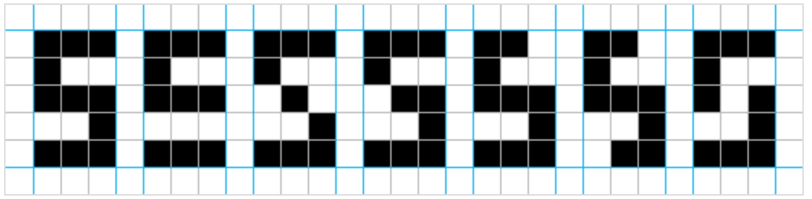

# Library for creating AI with Dart

Created under a MIT-style
[license](https://github.com/YevhenKap/ai/blob/master/LICENSE).

## Overview

This library represent an simple way to create neural network.
Currently **multilayer** and **single-layer** perceptron can be created.
In learning used __backpropagation__ algorithm for both of them.

### API

Perseptron is designed due to Rosenblatt's perseptron.

The main class is the `MultilayerPerseptron` which can contains `Layers`.
Each layer consist of one or many `Neuron`s.
First layer always consist of `InputNeuron`s where each of them take one input value and have weight equal to 1.
All neurons of previous layer have contacts with each neurons of next layer.

#### Memory

Neural network have long-time and short-time memory.
All information (knowledge - weights of synapces) of neural network during studying pass through short-time memory.
When studying finished and knowledge is structured, then it pass to long-time memory.
Knowledge is saved in JSON file `knowledge.json` in `resources` directory.
For next time network take knowledge from file and initialize with proper weights.

## Sample

This testing network recognize number 5 from numbers in range from 0 to 9. Also she detects distorted numbers of 5.



```dart
import 'package:ai/ai.dart';

void main() {
  final l1 = Layer<InputNeuron>(<InputNeuron>[
    InputNeuron(),
    InputNeuron(),
    InputNeuron(),
    InputNeuron(),
    InputNeuron(),
    InputNeuron(),
    InputNeuron(),
    InputNeuron(),
    InputNeuron(),
    InputNeuron(),
    InputNeuron(),
    InputNeuron(),
    InputNeuron(),
    InputNeuron(),
    InputNeuron()
  ]);
  final l2 = Layer<Neuron>(<Neuron>[
    Neuron(15),
    Neuron(15),
    Neuron(15),
    Neuron(15),
    Neuron(15)
  ]);
  final l3 = Layer<Neuron>(<Neuron>[
    Neuron(5)
  ]);
  final n = MultilayerPerceptron(<Layer<NeuronBase>>[
    l1,
    l2,
    l3
  ]);

  final expected = <double>[0.01, 0.01, 0.01, 0.01, 0.01, 0.99, 0.01, 0.01, 0.01, 0.01];

  // Learning data
  final trainInput = <List<double>>[
    '111101101101111'.split('').map(double.parse).toList(),
    '001001001001001'.split('').map(double.parse).toList(),
    '111001111100111'.split('').map(double.parse).toList(),
    '111001111001111'.split('').map(double.parse).toList(),
    '101101111001001'.split('').map(double.parse).toList(),
    '111100111001111'.split('').map(double.parse).toList(), // 5
    '111100111101111'.split('').map(double.parse).toList(),
    '111001001001001'.split('').map(double.parse).toList(),
    '111101111101111'.split('').map(double.parse).toList(),
    '111101111001111'.split('').map(double.parse).toList()
  ];

  // Testing data
  final testInput = <List<double>>[
    '111100111000111'.split('').map(double.parse).toList(),
    '111100010001111'.split('').map(double.parse).toList(),
    '111100011001111'.split('').map(double.parse).toList(),
    '110100111001111'.split('').map(double.parse).toList(),
    '110100111001011'.split('').map(double.parse).toList(),
    '111100101001111'.split('').map(double.parse).toList()
  ];

  // Number which this network must recognize
  final num5 = '111100111001111'.split('').map(double.parse).toList();

  // This network trains
  n.train(input: trainInput, expected: expected, learningRate: 0.42, epoch: 5000);

  // This network predicts result
  print('Recognize 5? - ${n.predict(num5)}');
  for (var item in testInput) {
    print('Recognize distorted 5? - ${n.predict(item)[0]}');
  }
  print('Аnd 0? - ${n.predict(trainInput[0])}');
  print('Аnd 8? - ${n.predict(trainInput[8])}');
  print('Аnd 3? - ${n.predict(trainInput[3])}');
```

## Features and bugs

Please file feature requests and bugs at the [issue tracker](https://github.com/YevhenKap/ai/issues).

**With ❤️ to AI**