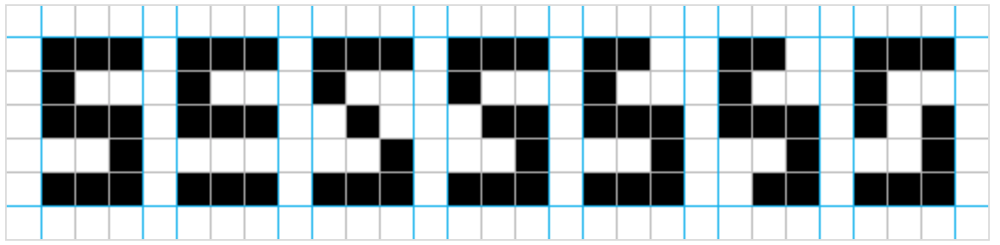

# Examples

This testing network recognize number 5 from numbers in range from 0 to 9. Also she detects distorted numbers of 5.



## MLP

```dart
import 'package:ai/ai.dart';

void main() {
  final n = MLP.from(Structure());

  // Expected results according to learning data (10)
  final expected = <List<double>>[
    <double>[0.01],
    <double>[0.01],
    <double>[0.01],
    <double>[0.01],
    <double>[0.01],
    <double>[0.99], // 5
    <double>[0.01],
    <double>[0.01],
    <double>[0.01],
    <double>[0.01]
  ];

  // Digits (Learning set)
  final trainInput = <List<double>>[
    '111101101101111'.split('').map(double.parse).toList(),
    '001001001001001'.split('').map(double.parse).toList(),
    '111001111100111'.split('').map(double.parse).toList(),
    '111001111001111'.split('').map(double.parse).toList(),
    '101101111001001'.split('').map(double.parse).toList(),
    '111100111001111'.split('').map(double.parse).toList(), // 5
    '111100111101111'.split('').map(double.parse).toList(),
    '111001001001001'.split('').map(double.parse).toList(),
    '111101111101111'.split('').map(double.parse).toList(),
    '111101111001111'.split('').map(double.parse).toList()
  ];

  // Digits 5 (Test set)
  final testInput = <List<double>>[
    '111100111000111'.split('').map(double.parse).toList(),
    '111100010001111'.split('').map(double.parse).toList(),
    '111100011001111'.split('').map(double.parse).toList(),
    '110100111001111'.split('').map(double.parse).toList(),
    '110100111001011'.split('').map(double.parse).toList(),
    '111100101001111'.split('').map(double.parse).toList()
  ];

  final num5 = '111100111001111'.split('').map(double.parse).toList();

  n.train(input: trainInput, expected: expected, learningRate: 0.1, epoch: 5000, visualize: true);

  print('Recognize 5? - ${n.predict(num5)}');
  for (var item in testInput) {
    print('Recognize distorted 5? - ${n.predict(item)[0]}');
  }
  print('Аnd 0? - ${n.predict(trainInput[0])}');
  print('Аnd 8? - ${n.predict(trainInput[8])}');
  print('Аnd 3? - ${n.predict(trainInput[3])}');

}
```